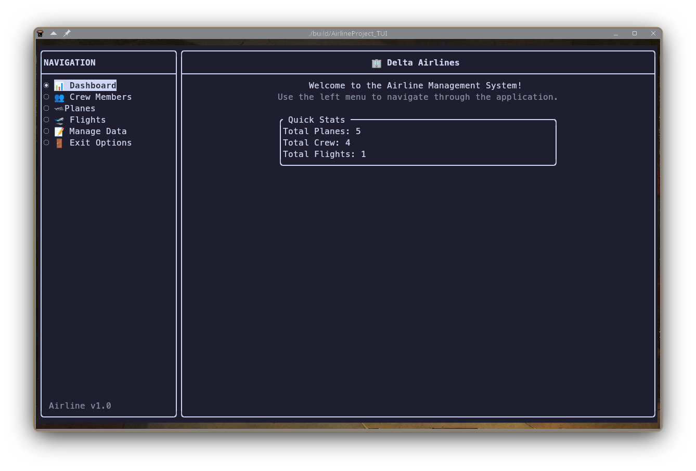
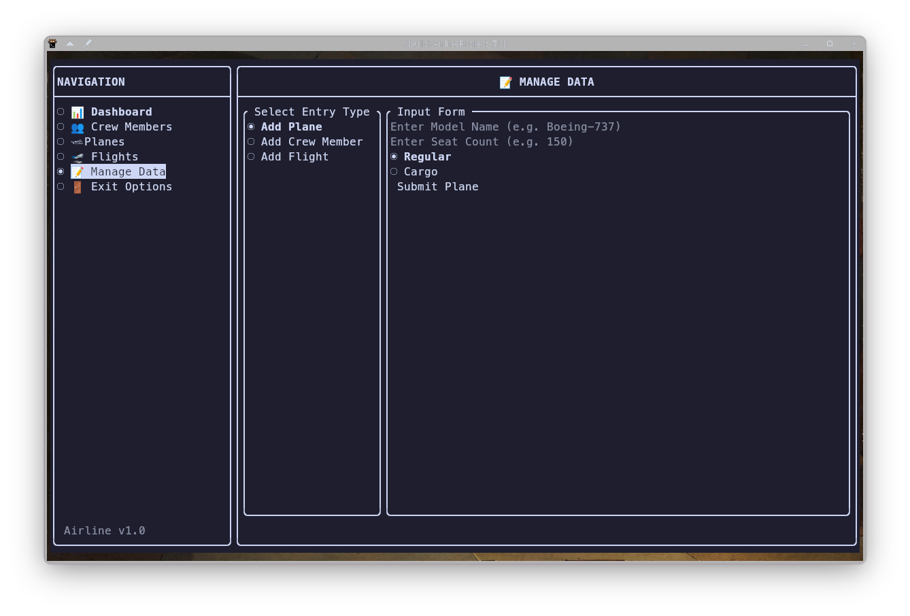

# ✈️ Airline Management System (C++ TUI)


A complete Airline Management System built in C++. This project demonstrates object-oriented programming, data persistence, and modern C++ build systems. It features both a standard Command Line Interface (CLI) for automated testing environments and a fully interactive **Terminal User Interface (TUI)** built with `FTXUI`.

---

## 📸 Previews
*(Upload your screenshots to the `/screenshots` folder and add them here!)*
<!-- Example: -->
<!--  -->
<!--  -->

---

## ✨ Key Features
* **Dual Interfaces:** Contains two distinct executables—a standard CLI and an interactive, mouse-driven TUI.
* **Interactive TUI Dashboard:** Navigate through visually formatted tables to view Planes, Crew Members, and Flights.
* **Dynamic Form Validation:** Seamlessly add new data (Cargo vs. Regular planes, Pilots vs. Hosts) through interactive terminal forms.
* **Data Persistence:** All states and entries are read from and saved to `data/Delta.txt` on exit.
* **Polymorphism in Action:** Deep reliance on inheritance (`CPlane` -> `CCargo`, `CCrewMember` -> `CPilot`) for rendering dynamic properties.

---

## 🛠️ Build & Installation Instructions

This project uses **CMake** to automatically handle dependencies (it will download the FTXUI library for you during configuration).

### Prerequisites
* A C++17 compatible compiler (`g++`, `clang`, or MSVC)
* CMake (3.14 or higher)
* Make

### Building the Project
Clone the repository and run the standard CMake build commands:
```bash
# 1. Clone the repository
git clone https://github.com/yourusername/Airline-Project.git
cd Airline-Project

# 2. Create the build directory
mkdir -p build && cd build

# 3. Configure and compile the code
cmake ..
make
```

### Running the Application
Ensure you run the executables from the root of the project so they can correctly locate the `data/Delta.txt` mock database!

**To run the modern Interactive TUI:**
```bash
./build/AirlineProject_TUI
```

**To run the standard CLI version:**
```bash
./build/AirlineProject
```

---

## 📂 Project Structure
```text
Airline-Project/
├── CMakeLists.txt         # Build configuration & dependency fetcher
├── src/                   # C++ Implementation Files
│   ├── main.cpp           # Standard CLI Entry Point
│   ├── main_tui.cpp       # FTXUI Interactive Entry Point
│   └── ...                # Core classes (CFlight, CPlane, etc.)
├── include/               # C++ Header Files
├── data/                  # Persistent data storage
│   └── Delta.txt          
└── build/                 # Compiled binaries (generated by CMake)
```
